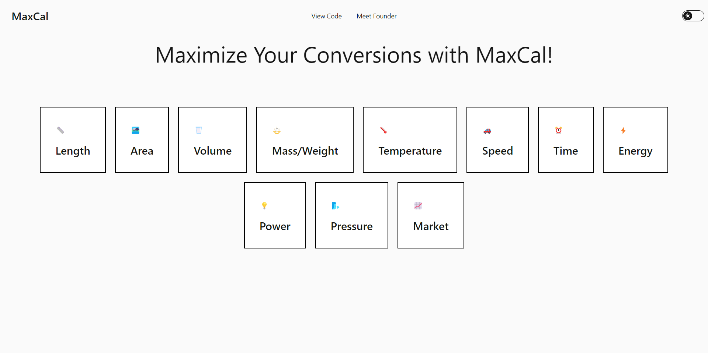

# MaxCal

MaxCal is a comprehensive unit converter application built using React.js. It allows users to convert various units across different categories including Length, Area, Volume, Mass/Weight, Temperature, Speed, Time, Energy, Power, and Pressure.

## Features

- Convert units across multiple categories.
- Simple and intuitive user interface.
- Support for reverse conversions.
- Error handling for invalid inputs.
- Easily customizable and extendable.

## Installation

To run MaxCal locally on your machine, follow these steps:

- git clone https://github.com/RakeshRoy-977/MaxCal
- cd MaxCal
- npm install
- npm run dev
